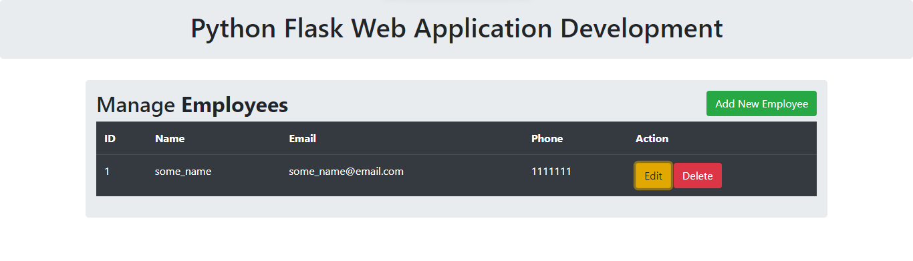

# Курсовой проект “Flask-приложение”
***
## Cтраница для менеджмента сотрудников компании:

### Функционал страницы:

- Отображается список сотрудников
- Кнопки для добавления (Add New Employee) записей
- Кнопки для редактирования (Edit) записей
- Кнопки для удаления (Delete) записей
***

Проект сделан на языке **Python** с использованием микрофреймворка **Flask**, шаблонизатора **Jinja** и **SQLAlchemy ORM**

### Содержание проекта:

- шаблон HTML-страницы c использованием шаблонизатора Jinja *папка templates*
- файл с настройками путей для БД *config.py*
- основная логика приложения на Flask с описанием модели и путей *app.py*
- база данных *employees.db* (при первом запуске необходимо раскомментировать создание таблицы в бд в файле app.py)